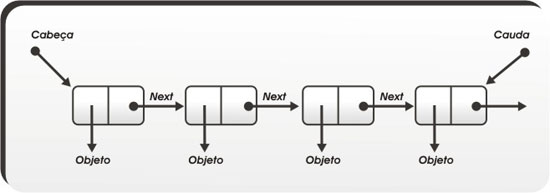

# Algoritmos de Lista Encadeada e Duplamente Encadeada.

## Lista Encadeada

> Uma lista ligada ou lista encadeada é uma estrutura de dados linear e dinâmica. Ela é composta por células que apontam para o próximo elemento da lista. Para "ter" uma lista ligada/encadeada, basta guardar seu primeiro elemento, e seu último elemento aponta para uma célula nula.
[Fonte](https://pt.wikipedia.org/wiki/Lista_ligada)

## Lista Duplamente Encadeada

>Em ciência da computação, uma lista duplamente ligada (ou lista duplamente encadeada) é uma estrutura de dados ligada que consiste de um conjunto de registros sequencialmente ligados chamados de nós e é uma extensão da lista simplesmente ligada (ou lista simplesmente encadeada). Cada nó contem dois campos, chamados de links ou enlaces, que são referências para o nó anterior e para o nó posterior na sequência de nós. Os links anteriores e posteriores dos nós inicial e final, respectivamente, apontam para algum tipo de terminador, tipicamente um nó sentinela ou nulo, para facilitar o percorrimento da lista.
[Fonte](https://pt.wikipedia.org/wiki/Lista_duplamente_ligada)

